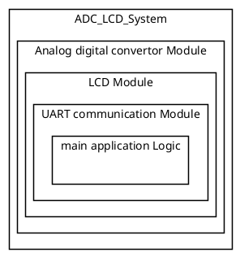
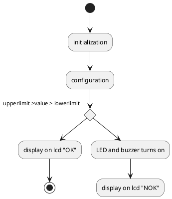
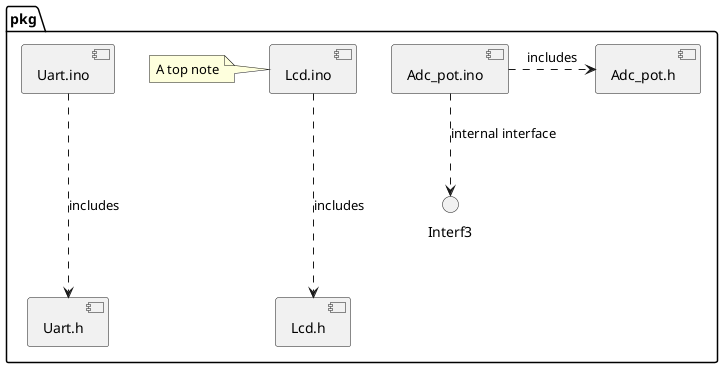

# Detailed Design Document

| **Author**              | `Ahmed Loulou, Sherif Helmy, Youssef Abouelkheir`                                       |
|:------------------------|:-----------------------------------------------------|
| **Status**              | `Inspection`                          |
| **Version**             | `1.0`                                                |
| **Date**                | `12/11/2024`                                         |

## Introduction

The purpose of this report is to show how an analog sensor sends its value to the Arduino and how an analog digital converter turns that signal into a digital signal that can be shown on an LCD screen. In addition to setting the sensors limits by making a range that can be changed with buttons.
Our project's goal is to show the value from the potentiometer, which is an analog sensor that sends a signal to the Arduino that gets converted to a digital signal using the built in ADC in the code. To do this, we use four buttons, two for the upper limit and two for the lower limit, to change the potentiometer's range and show the limits, on a 16x2 LCD, along with the potentiometer's value.
A potentiometer, an ADC, and an LCD can be used to model real-world control systems and show how analog to digital conversion works in real life. As an example, the potentiometer can be used as a thermostat dial in a device that controls temperature. The temperature setting is changed by moving the potentiometer. The ADC reads the temperature setting and turns it into a precise number that is shown on the LCD. This acts like setting and checking the temperature in a home's heating or cooling system. A light dimmer control is another example. In this case, the potentiometer is a dimmer button. When you turn the potentiometer, the brightness that you see changes, and the ADC turns this into a percentage that is shown on the LCD. This simulation gives a good picture of how light levels can be changed in current lighting systems. It also shows how analog input and digital output work together.

### Purpose
This low-level design specification describes the internal structure and the functions of the software module. It describes the interaction, data structures, specific embedded constraints and background information about design. This specification is the basis for coding and is an input document for the corresponding module test specification. The terms Low-level design specification and module specification are used interchangeably in Valeo to refer to documents of this type.

### Scope
This report describes how an Arduino-based system works and how it was designed. The system uses a potentiometer as an analogue input, an LCD as an output display, and buttons to change the upper and lower limit ranges on the fly. The potentiometer gives an analogue signal to the Arduino. The built-in ADC turns the signal into a digital value, which is then shown on a 16x2 LCD. The system lets users set these movable limits and see them along with the sensor's current value. This lets them model real-world uses like controlling the temperature or dimming the lights. This file is a basic outline for the software's framework, how its parts work together, and any built-in restrictions. It will help with future development and testing.

## Architectural Overview

This section describes where this module resides in the context of the software architecture

### Assumptions & Constraints
Indicate constraints of the low level design and any assumptions appropriate for the design.

## Functional Description
This code takes the value of an analogue sensor, compares it to upper and lower limits that can be set, and shows the result on an LCD screen. It sets up the ADC, UART, and LCD modules and their starting values for upperlimit and lowerlimit after setting up certain pins as inputs with pull-up resistors for buttons. The code reads the sensor value from the ADC, turns it into a string, sends it over UART, and shows the string along with the current limits on the LCD in the main loop. Users can change these limits on the fly by pressing buttons. The code turns off an LED and displays "OK" on the LCD if the sensor reading is within the range given. If it's not, it turns on the LED and displays "NOK." This shows how to watch and control an analogue input in real time with thresholds that can be changed.

## Implementation of the Module
This project uses Arduino to show analog-to-digital conversion (ADC) and display the digital signal on an LCD with changeable limit ranges via buttons. An analogue potentiometer, an LCD screen to show data, buttons for interactive range limit control, and an LED for feedback are the main hardware components. The Arduino's ADC digitises the potentiometer's analogue variable input signal. This digital reading and user-defined upper and lower limits are shown on a 16x2 LCD screen in real time.

The system continuously reads the potentiometer's output and checks for limitations using the ADC. Four buttons let users dynamically alter these limits: two for the higher limit and two for the lower limit. A normal state is indicated by a "OK" LCD message and an off LED when the sensor reading is within the defined range. The LED and "NOK" message inform the user if the reading is outside this range.

This configuration simulates real-world control systems. In a heating or cooling system, the potentiometer could replicate a thermostat dial and the ADC would transform the temperature setting into a digital display. In this example, the LCD would display the specified temperature and safe or desirable limits in real time. The potentiometer might be a dimmer switch for lighting control, with the ADC converting brightness levels into LCD percentages. The dynamic change of limits in both examples shows how users can interactively control and monitor analogue values in digital formats.

This paper describes each software module's structure and functions as a low-level design specification. The system's underlying workings are explained by covering component interactions, embedded data structures, and design limitations. This design document establishes each component's functionality and role in the system, guiding coding and testing.

## Integration and Configuration
### Static Files
Typically a module consists of C and H files but other file types may exist. List all files that form this module

| File name | Contents                             |
|-----------|--------------------------------------|
| Adc_pot.h | header for adc functions        |
| Lcd.h     | header for lcd functions                |
| Uart.h    | header for uart communications functions |
| Adc_pot.ino | Includes all adc functions and initlization         |
| Lcd.ino    | Includes all Lcd functions and initlization                |
| Uart.ino   | Includes all uart communications functions and initlization |
| alexprojec.ino   | Includes the main code for the apllication |
### Include Structure

If there is a complex file structure e.g. more than one c-file or more than two h-files use a diagram to explain the relationship between the source and dependent include files.

### Configuration
Any required hardware/software or system configuration that can be adjusted a header file shall be detailed in this section. This can be placed in the table below.
| Name | Value range | Description |
|------|-------------|-------------|
|   limit   |     400-700        |     Uses upper and lower limit to create a range        |
|   Baudrate  |     9600       |     sets the baudrate       |
