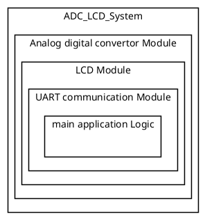
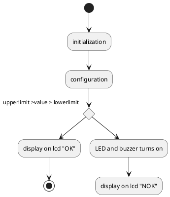
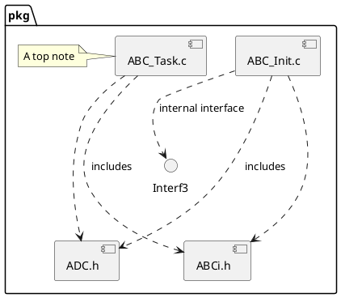

# Detailed Design Document

| **Author**              | `Authors Name`                                       |
|:------------------------|:-----------------------------------------------------|
| **Status**              | `Draft/Inspection/Approved`                          |
| **Version**             | `1.0`                                                |
| **Date**                | `dd/mm/yyyy`                                         |

## Introduction

Provide an overview of the entire document:

* Identify the system/product using any applicable names and/or version numbers.

### Purpose
This low-level design specification describes the internal structure and the functions of the software module. It describes the interaction, data structures, specific embedded constraints and background information about design. This specification is the basis for coding and is an input document for the corresponding module test specification. The terms Low-level design specification and module specification are used interchangeably in Valeo to refer to documents of this type.

### Scope
Explanation:-
* Give information on project context, where this document applies.
* Also a reference for more project information can be given.
* Classification for P2, P1, and P0. shall be given.

## Architectural Overview

This section describes where this module resides in the context of the software architecture

### Assumptions & Constraints
Indicate constraints of the low level design and any assumptions appropriate for the design.

## Functional Description
The following chapter describes the software functionality.  The following is a list of suggested sections to be considered for inclusion.

## Implementation of the Module
This chapter discusses the detailed design of the module.

## Integration and Configuration
### Static Files
Typically a module consists of C and H files but other file types may exist. List all files that form this module

| File name | Contents                             |
|-----------|--------------------------------------|
| Adc_pot.h | header for adc functions        |
| Lcd.h     | header for lcd functions                |
| Uart.h    | header for uart communications functions |
| Adc_pot.ino | Includes all adc functions and initlization         |
| Lcd.ino    | Includes all Lcd functions and initlization                |
| Uart.ino   | Includes all uart communications functions and initlization |
### Include Structure

If there is a complex file structure e.g. more than one c-file or more than two h-files use a diagram to explain the relationship between the source and dependent include files.

### Configuration
Any required hardware/software or system configuration that can be adjusted a header file shall be detailed in this section. This can be placed in the table below.
| Name | Value range | Description |
|------|-------------|-------------|
|      |             |             |
